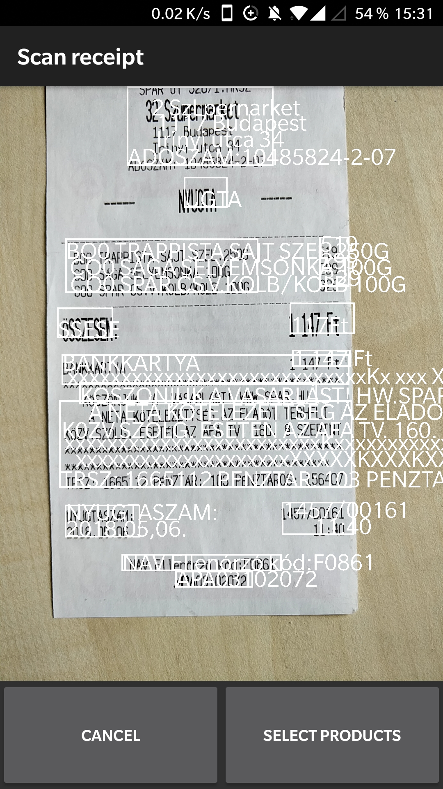
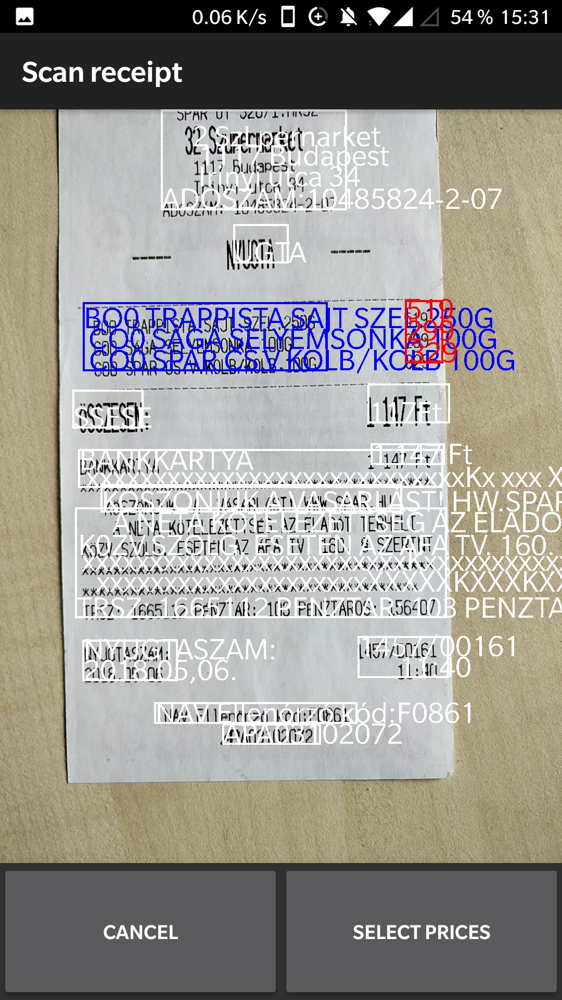
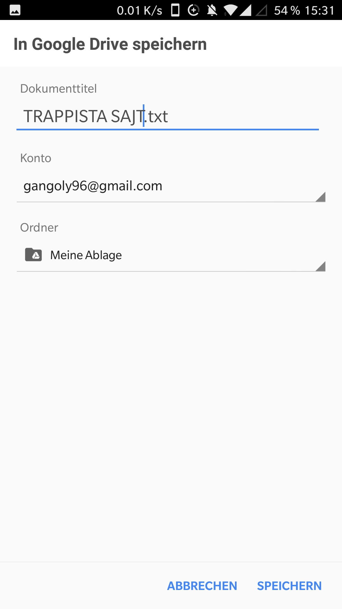
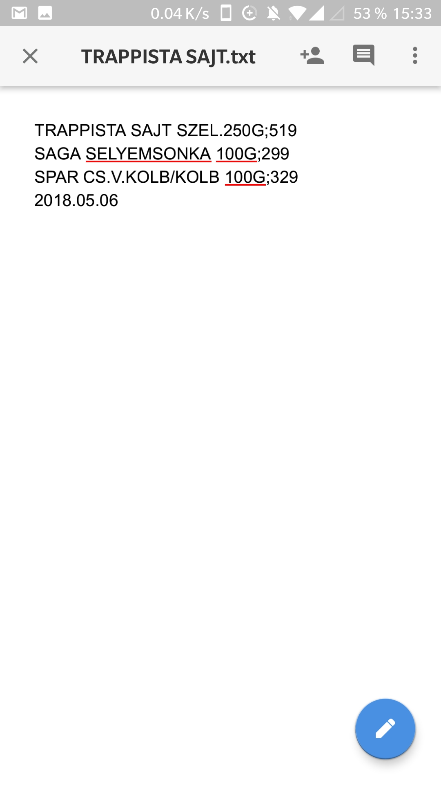

# Receipt scanner
This is an android app, capable to digitise the items and their prise on a receipt. It uses the textrecognizer shipped with android SDK. It processes the text to extract the items name and price.

   
   
   
  

